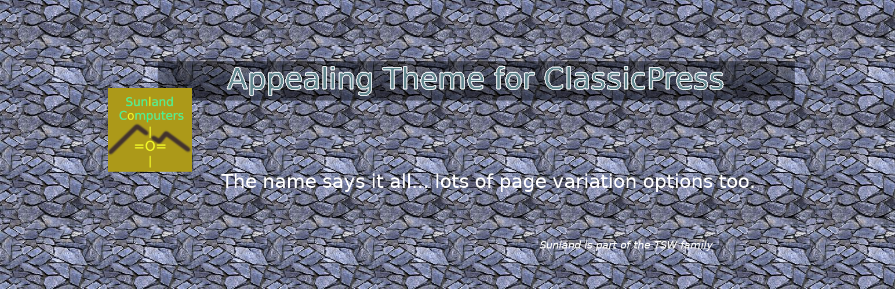

# Appealing
The name says it all. An appealing theme made for ClassicPress.

Requires PHP: 7.4
Requires CP:  1.4
Version:      1.0.4
Author:       Larry Judd
Tags:         two-columns, translation-ready, featured-images, blog, e-commerce, news, custom-menu, custom-background, custom-logo, custom-header
License:      GPL 3 (see LICENSE)
Text domain:  apealing
URI:          https://github.com/tradesouthwest/appealing/

## Description: 
Appealing features a pull-quote block in the main content to display a short teaser. Theme has a Two-column Newspaper-style template, a Full-width, a Three-section-wide, an advert top-bar and an Author template with a modal box linked to every author. This is perfect for writers who want to self-promote their articles. Customize where title is shown, color of links and content backgrounds, custom featured image and header image with logo support; set color, width and number of words for pullquote teaser; set Post excerpt length. Parent navigation is mobile first yet has an off switch for desktop. Full Instructions. WooCommerce ready. Demo at https://larryjudd.us/appeal

##  Author:      Larry Judd Oliver

